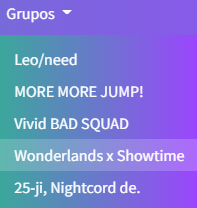

# Proyecto DIW - DWECL

## ÍNDICE

1. [DESCRIPCIÓN](#id1)
2. [PROTOTIPO](#id2)
3. [MODIFICACIONES A LA GUÍA DE ESTILOS](#id3)
4. [RECURSOS](#id4)

## DESCRIPCIÓN ``

SekaiSchool es una página web dedicada al videojuego de ritmo Project Sekai. Contiene numerosos recursos para los jugadores, como una lista de cartas e información sobre los grupos y personajes del juego, así como la posibilidad de interactuar con otros jugadores mediante los comentarios de la comunidad. Al entrar en la página se da la bienvenida al usuario y se muestra la información sobre el evento y el gacha más reciente del juego.

* **Perfil**. Los usuarios disponen de un perfil en el que pueden personalizar varios datos, como la biografía, la foto de perfil, personaje y grupo favoritos, cumpleaños, redes sociales y otros datos del juego. También pueden mostrar su colección de cartas y guardar en su lista de deseos aquellas cartas que quieran tener en un futuro.
* **Cartas**. Es una base de datos de las cartas del juego que permite filtrar por distintos aspectos, como el grupo, la rareza, el atributo o el personaje. Permite ver la versión mejorada de las cartas de tres y cuatro estrellas al pasar el ratón por encima.
* **Personajes**. Abre un modal que contiene todos los personajes del juego y abre la página del seleccionado, la cual muestra información como sus datos básicos, historia, personalidad, trivia, relaciones y cómics en los que aparece.
  * El personaje usado para mostrar el diseño en este proyecto es, al igual que en el prototipo, Mizuki:

    
* **Comunidad**. Permite la interacción entre usuarios mostrando una lista de publicaciones ordenadas según el tema escogido, además de elegir si se quieren ver las más recientes o las populares. Muestra una lista de tendencias, que son los temas de los que más hablan los usuarios actualmente, así como un buscador. Permite redactar publicaciones y comentar y marcar como favorito otras publicaciones.
* **Grupos**. Muestra imágenes información del grupo escogido incluyendo los integrantes y la historia de este. Contiene un foro dedicado a hablar sobre el grupo, el cual se puede expandir pulsando sobre el icono de maximizar.
  * El grupo usado para mostrar el diseño en este proyecto es, a diferencia del prototipo, Wonderlands x Showtime:

    

Las decisiones de diseño como la temática y los colores de SekaiSchool están basadas en Project Sekai para mejorar la ambientación y la experiencia de la audiencia a la que está dirigido. Los colores principales son similares y en las páginas de personajes y grupos se usan sus respectivos colores (por ejemplo, la página de Mizuki usa su color rosa característico).

La temática de la página también se relaciona con el espacio y las estrellas, haciendo referencia a Leo/need, el grupo principal del juego. Esto es así porque toma su nombre de las leónidas, una lluvia de meteoros que viene de la consteación de Leo; además de que los apellidos de los integrantes del grupo hacen referencia a distintos cuerpos celestes.

## PROTOTIPO ``

[https://www.figma.com/file/AHWj58PAo7JKzitmErZxnU/sekaischool?node-id=0%3A1&amp;t=igLO9ucvrDLjuPPU-0]()

## MODIFICACIONES A LA GUÍA DE ESTILOS ``

[Listado de modificaciones realizadas debidamente justificadas. ]

### * **Cambios genéricos**

* Header

  1. La apariencia del botón de `Iniciar sesión` ahora es la de un enlace normal, ya que el botón desentonaba con el resto de la cabecera.
  2. Se ha añadido `Grupos` a la navbar. Es un menú desplegable que muestra los grupos.
* Otros

  1. CSS dificulta la posibilidad de crear elementos con fondo y un borde degradado y redondeado. Para solventar esto, dichos elementos tienen un degradado de fondo creado manualmente lo más parecido posible al color que tendrían originalmente.
  2. Se han ajustado los colores de cada página.

### * **Inicio**

1. La imagen de fondo se ha cambiado a una más acorde a la temática y paleta de colores de la página, incluyendo a las dos protagonistas del videojuego y tonalidades azules, verdes y rosas como predominantes. Para ajustarse al tamaño correctamente, esta imagen cambiará cuando se vea desde una tablet o una pantalla más pequeña que esta.
2. Inspirada en páginas similares para otros juegos, la estructura en pantallas grandes se encuentra en la parte derecha para dejar a la vista la imagen de fondo. Además, se le ha añadido un degradado blanco para una mejor visibilidad del contenido de la página.
3. El color del texto ahora es sólido para destacar más sobre el fondo.
4. Las tarjetas de evento y gacha se han cambiado por las tarjetas oficiales del juego. Anteriormente estaban los logos, pero podían dar problemas al ser cada uno de distinto tamaño, además de que las tarjetas oficiales se entienden mejor.

### * **Cartas**

1. En cada contenedor de carta sólo hay una versión de la misma en vez de las dos. La versión se cambia al pasar el ratón por encima (*hover*).

### * **Personaje (Mizuki)**

1. La estructura de la parte derecha ha cambiado para ordenar las cajas de información (`Historia` y `Datos básicos`) en una sola columna y tener la sección `Personalidad` separada. El cómic también está separado.

### * **Perfil personal**

1. Los botones de cumpleaños, grupo favorito y redes sociales se han separado para distinguir mejor la información del usuario además de añadir margen inferior.
2. Las tabs de `Lista de cartas` y `Lista de deseos` ahora están dentro de la caja de cartas para alinearlo con las demás tabs (`Publicaciones` y `Datos del juego`). También se ha ajustado el tamaño de las cartas.

### * **Grupo (WxS)**

1. La estructura de la página ha cambiado de forma que los elementos se sitúan alrededor de la imagen de los miembros del grupo, la cual está ubicada en el centro para llamar la atención del usuario. El logo está encima de la imagen y las cajas de `Miembros` están a cada lado de la imagen.
2. La sección de `Historia` ya no es una caja, sino un texto, similar a la sección de `Personalidad` en la página de personaje.
3. Debido al cambio en la estructura de la página, ya no tenía sentido colocar el sticker en el mismo lugar, por lo que se ha convertido en una nueva sección con un sticker de cada miembro por parejas.
4. El `Foro`, que se abre al pulsar el botón de maximizar dentro de esta sección, permite alternar entre modo oscuro y claro además de los cambios que incorpora la página original de grupo. A diferencia del prototipo, únicamente cambia el fondo, ya que la temática de la página se ve reflejada en los colores que usa y cambiarlo contrastaría demasiado. Para lograr este efecto se ha usado un pequeño fragmento de código JavaScript que cambia la imagen de fondo.

### * Comunidad

1. Se ha ajustado el orden de los botones de `Temas populares` para que se vean agrupados por tamaño.
2. Las fotos de las publicaciones ahora forman parte de la estructura de la publicación en sí, de forma que no es necesario recortarla y se integra mejor en la página.
3. La caja `Escribir post` ahora se encuentra arriba, junto a `Temas populares`, para ser más accesible y que todas las funciones de la página se encuentren en la parte superior, mientras que en la parte inferior están las publicaciones.

## ENTREGA 4

### * Picture y puntos de ruptura

Las imágenes son responsive gracias a Bootstrap, así que no tienen puntos de ruptura. Sin embago, para poner un ejemplo he cambiado la imagen del personaje en su página correspondiente: a partir de los 576 píxeles se muestra la imagen normal, mientras que antes de eso aparece su versión chibi.

### * Audio

El autoplay para la música de fondo sólo funciona dándole permisos en Firefox. El audio de los vídeos sí funciona correctamente en Chrome.

### * Vídeos

Los vídeos de testimonios se encuentran en una nueva página destinada para esto llamada `Testimonios`. 

El vídeo de fondo está situado en el `Inicio`. Para mantener la estética de la página, el fondo de esta sigue siendo el mismo, pero el vídeo está superpuesto con baja opacidad y un degradado transparente que ayuda a integrarlo con el resto de los elementos de la página.

### * Filtro

Ya que los filtros no quedan bien con las imágenes de los proyectos con marca de agua, le he aplicado un filtro *drop-shadow* a la lista de cartas en la página de perfil. De esta forma, al hacer *hover* sobre las cartas, se ilumina alrededor de estas.

## RECURSOS ` `

[Listado de recursos usados]

- **Can I use?**: https://caniuse.com/
- **Bootstrap**: https://getbootstrap.com/
- **FontAwesome**: https://fontawesome.com/
- **W3C CSS Validator**: https://jigsaw.w3.org/css-validator/
- **W3C HTML Validator**: https://validator.w3.org/
